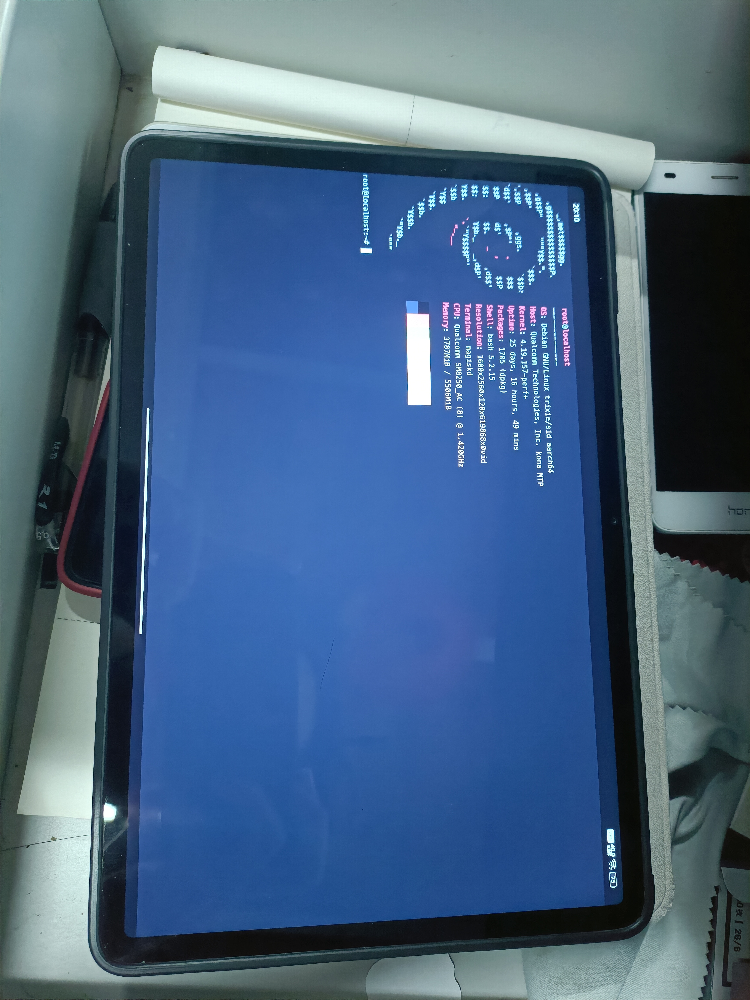

# Get some preparation first
* get your phone rooted and flash busybox module in magisk.
* in termux, give su and storage permission.
* apt update
* apt install git
* git clone and go into the Directory
# Run run.sh first
* relaunch termux.
* then you get debian installed (run debian to login)
# copy init.sh to /data/local/tmp/debian/
* then login debian and run 'sh /init.sh'
# showcase
* 
